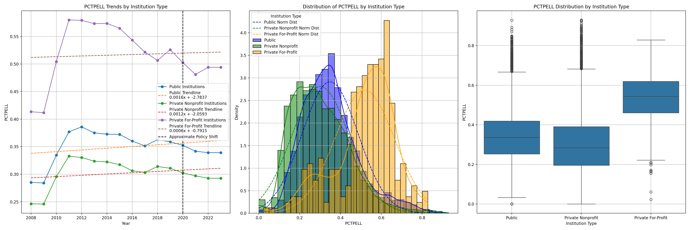
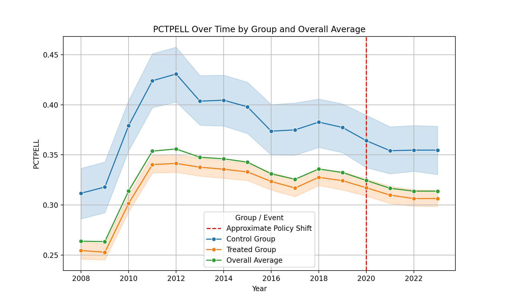
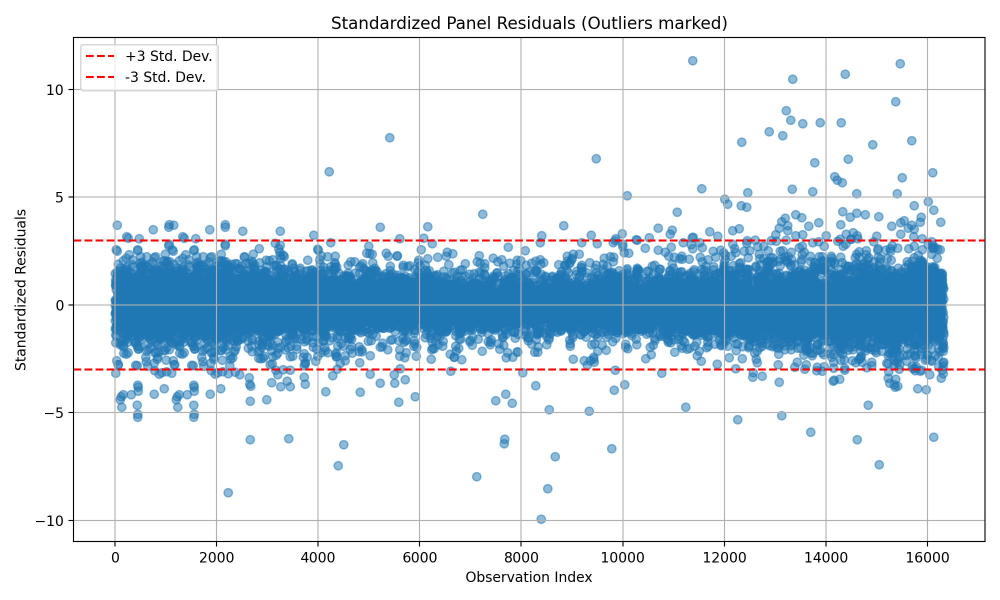

# Test-Optional Impact Study

### Project Overview
This project aims to analyze the effects of test-optional admissions policies on various educational outcomes in U.S. higher education. The project looks at the period around 2020 when many institutions adopted test-optional policies in response to the COVID-19 pandemic.

### Data
The analysis uses College Scorecard data spanning from 1996 to 2023, tracking institution admissions policies and various outcome metrics over time. The dataset includes:

- Admissions test requirements (ADMCON7)
- Demographic indicators (PCTPELL, UGDS_BLACK, UGDS_HISP, etc.)
- Academic outcomes (retention rates, withdrawal rates by income level, graduation rates)
- Financial metrics (student debt, percentage of students with loans)

### Analysis Components

- Data Processing
- Extracts relevant variables from raw College Scorecard data files
- Tracks changes in test requirement policies (ADMCON7) over time
- Creates a longitudinal dataset of selected institutions

### Descriptive Analysis

- Time series visualizations of admissions policy changes
- Distribution plots comparing test-optional vs. test-required institutions
- Institutional type analysis separating public, private non-profit, and for-profit institutions

#### Sample Graph

### Panel Analysis
- Difference-in-difference models using PanelOLS with entity and time fixed effects
- Multicollinearity diagnostics via variance inflation factor analysis
- Residual diagnostics including heteroskedasticity and normality tests
- Visualization of trends and treatment effects

#### Sample Graph

